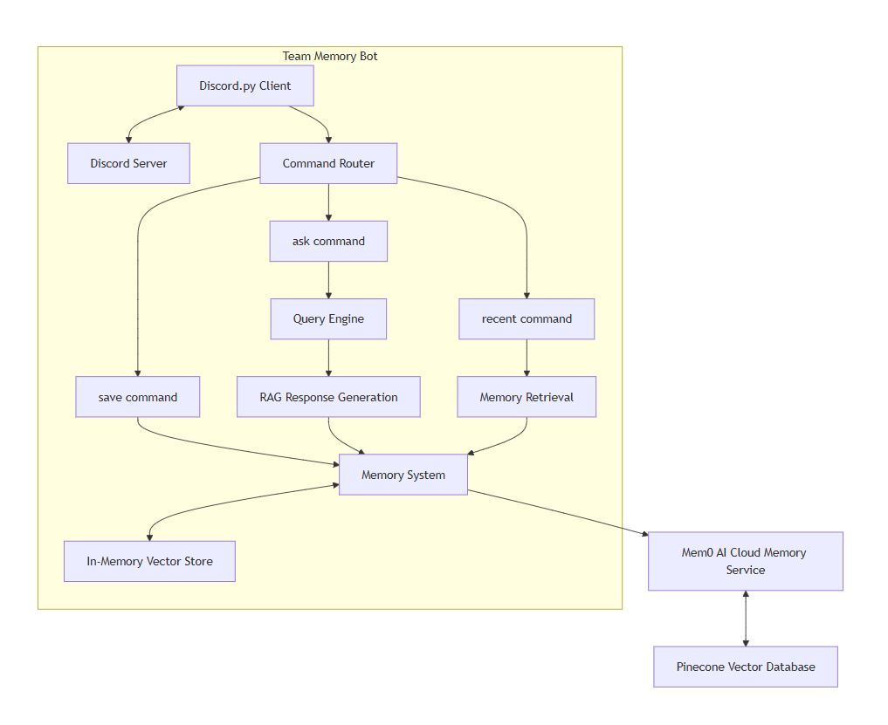
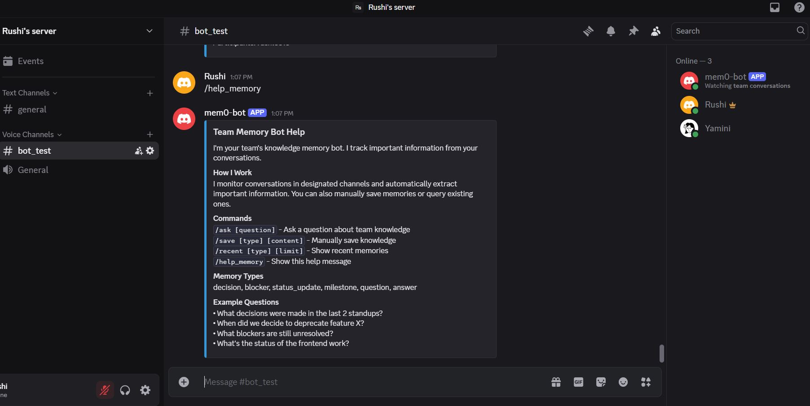
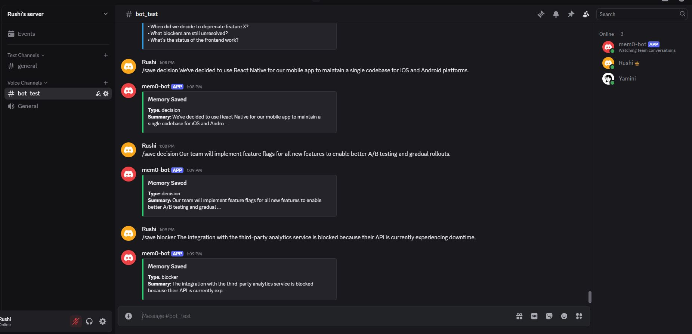
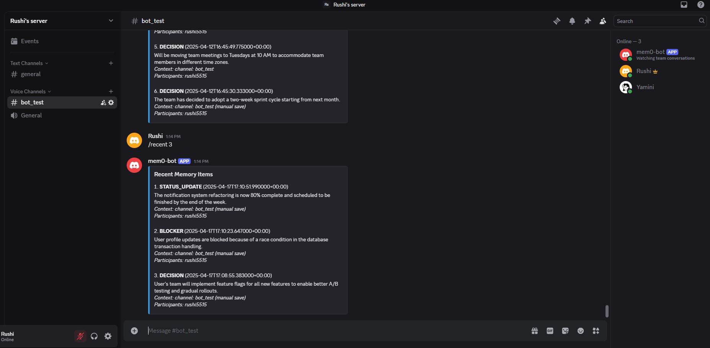
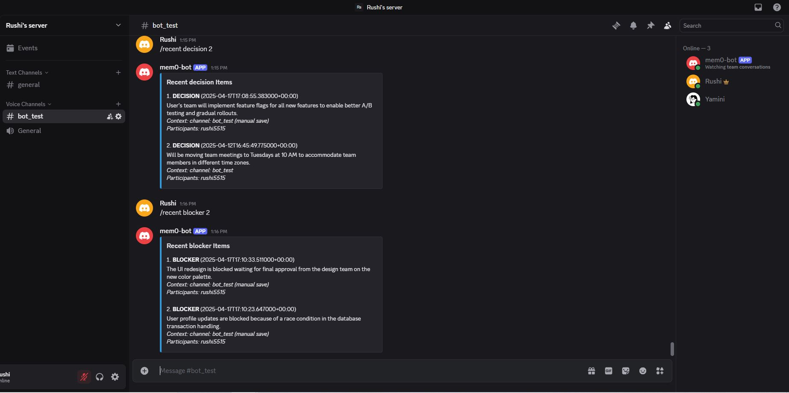
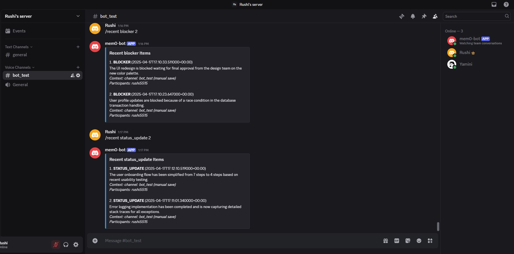
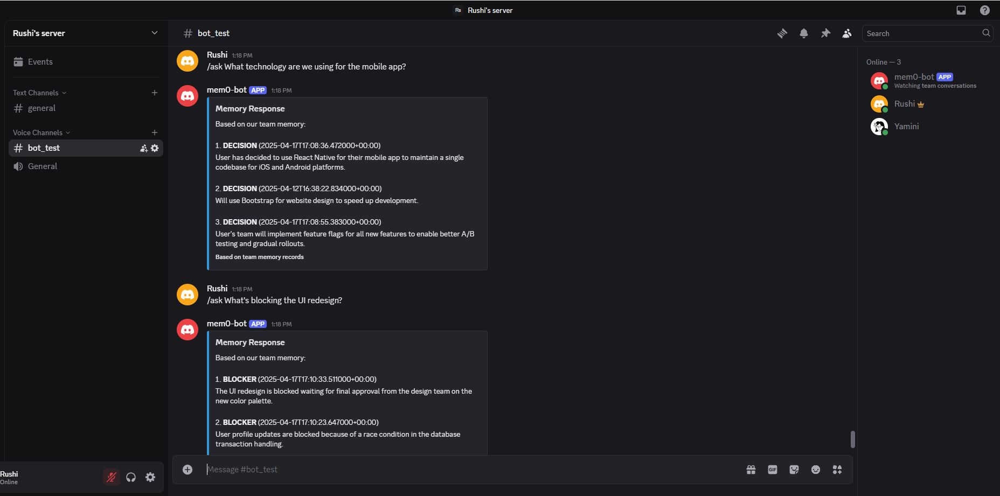
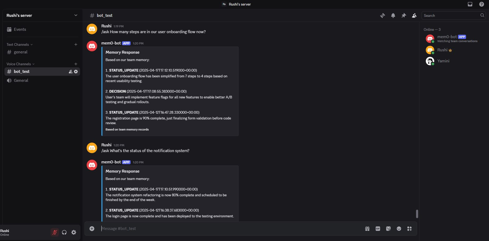
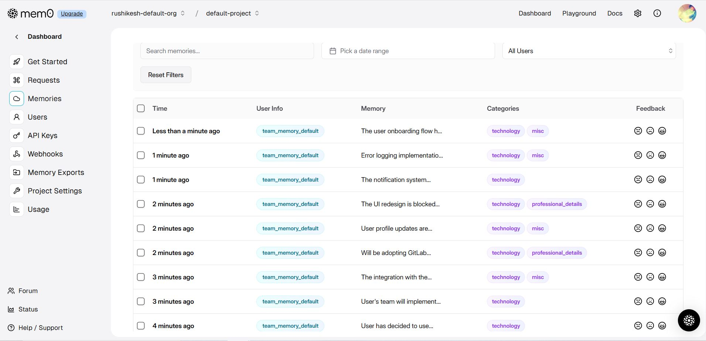

# Team Memory Bot 🧠💬

A Discord bot that captures, stores, and retrieves team knowledge using Mem0 AI for persistent memory storage.

## 📋 Table of Contents

- [Overview](#overview)
- [Features](#features)
- [System Architecture](#system-architecture)
- [Setup and Installation](#setup-and-installation)
- [Usage](#usage)
- [Command Examples](#command-examples)
- [Example Results](#example-results)
- [Customization](#customization)
- [Troubleshooting](#troubleshooting)
- [Contributing](#contributing)
- [License](#license)

## 🌟 Overview

Team Knowledge Memory Bot transforms team conversations into a searchable knowledge base. It monitors Discord channels, extracts important information, and makes it easily retrievable using natural language queries. By connecting to Mem0 AI's memory system, it provides persistent storage of team knowledge across time.

**Built in collaboaration with Bear Brown and Co, and Stellis Labs.**

## ✨ Features

- 🤖 **Automatic Knowledge Extraction**: Identifies important information from team conversations
- 🧠 **Cloud-Based Memory Storage**: Leverages Mem0 AI for reliable knowledge persistence
- 🔍 **Vector-Based Semantic Search**: Finds information based on meaning, not just keywords
- 📝 **Knowledge Classification**: Organizes information by type (decisions, blockers, etc.)
- 💬 **Natural Language Queries**: Ask questions in plain language to retrieve information
- 📊 **Context Preservation**: Maintains the context in which information was shared
- 🔄 **Manual Saving**: Explicitly save important information with simple commands

## 🏗️ System Architecture

The Team Knowledge Memory Bot features a modular architecture with five key components:

1. **Discord Bot Layer:** Handles all user interactions and command processing through Discord.py, managing message events and command routing.
2. **Knowledge Processing Pipeline:** Extracts and classifies important information from messages, turning unstructured conversations into structured data.
3. **Memory System:** Integrates with Mem0 AI to provide persistent storage of team knowledge with contextual metadata.
4. **Vector Search Engine:** Enables semantic search capabilities through either Pinecone (cloud-based) or an in-memory implementation.
5. **Query Engine:** Processes natural language questions, retrieves relevant information, and generates concise, informative responses.

This design prioritizes modularity and extensibility, allowing components to be developed and tested independently while maintaining clean interfaces between layers.



## 🛠️ Setup and Installation

### Prerequisites

- Python 3.10 or higher
- A Discord bot token (from Discord Developer Portal)
- A Mem0 AI API key
- [Optional] A Pinecone API key for enhanced vector search

### Installation Steps

Clone the repository:

```bash
git clone https://github.com/rkarwankar/team-memory-bot
cd team-memory-bot
```

Create a virtual environment:

```bash
python -m venv venv
```

#### On Windows

```bash
venv\Scripts\activate
```

#### On macOS/Linux

```bash
source venv/bin/activate
```

Install dependencies:

```bash
pip install -r requirements.txt
```

Create a `.env` file with your configuration:

```env
# Discord Configuration
DISCORD_BOT_TOKEN=your_discord_bot_token_here
DISCORD_GUILD_ID=your_guild_id_here
MONITORED_CHANNELS=123456789012345678,234567890123456789

# Mem0 Configuration
MEM0_API_KEY=your_mem0_api_key_here

# Vector Database (Choose one)
VECTOR_DB=in_memory # or "pinecone"

# If using Pinecone
PINECONE_API_KEY=your_pinecone_api_key_here
PINECONE_ENVIRONMENT=your_pinecone_environment
PINECONE_INDEX_NAME=team-memory
```

Invite the bot to your server using the OAuth2 URL generator in the Discord Developer Portal (require bot permissions including read/send messages)

## 📁 File Structure

```plaintext
team-memory-bot/
├── .env
├── .gitignore
├── README.md
├── requirements.txt
├── src/
│   ├── __init__.py
│   ├── main.py
│   ├── config.py
│   ├── bot/
│   │   ├── __init__.py
│   │   ├── client.py
│   │   ├── commands.py
│   │   └── listeners.py
│   ├── preprocessing/
│   │   ├── __init__.py
│   │   ├── extractor.py
│   │   └── classifier.py
│   ├── memory/
│   │   ├── __init__.py
│   │   ├── mem0.py
│   │   └── vector_store.py
│   ├── query_engine/
│   │   ├── __init__.py
│   │   ├── engine.py
│   │   └── rag.py
│   └── utils/
│       ├── __init__.py
│       └── helpers.py
└── tests/
    ├── __init__.py
    └── test_memory.py
```

## 🚀 Usage

### Starting the Bot

Run the bot:

```bash
python src/main.py
```

### Commands

- `/help_memory` - Show help information
- `/save [type] [content]` - Manually save knowledge
- `/recent [type] [limit]` - Show recent memories
- `/ask [question]` - Ask a question about team knowledge

### Memory Types

- `decision`
- `blocker`
- `status_update`
- `milestone`
- `question`
- `answer`

## 📝 Command Examples

```bash
/save decision We've decided to use React Native for our mobile app...
/save blocker The integration with the third-party analytics service is blocked...
/save status_update The notification system refactoring is now 80% complete...
/save milestone We've successfully completed the beta launch...
/recent 5
/recent decision 3
/ask What technology are we using for the mobile app?
/ask What's blocking the analytics integration?
/ask What's the status of the notification system?
```

## 📹 Demo Video

https://github.com/user-attachments/assets/bb07f74c-0379-45f3-8e8c-8d9813fdeefb

## 📸 Example Results

1. Help Screen
   

2. Saving Knowledge
   

3. Recent Commands
   
   
   

4. Ask Commands
   
   

5. Mem0 Portal
   

## ⚙️ Customization

### Configuring Monitored Channels

Update `MONITORED_CHANNELS` in `.env`

### Using Different Vector Storage

- In-Memory (default):
  ```env
  VECTOR_DB=in_memory
  ```
- Pinecone (production):
  ```env
  VECTOR_DB=pinecone
  PINECONE_API_KEY=your_pinecone_api_key
  PINECONE_ENVIRONMENT=your_environment
  PINECONE_INDEX_NAME=team-memory
  ```

### Adjusting Response Format

Modify `generate_rag_response` in `src/query_engine/rag.py`

## 🔧 Troubleshooting

### Bot Not Responding

- Check bot token
- Verify permissions
- Check monitored channels
- Review console output

### Memory Retrieval Issues

- Check Mem0 API key
- Verify memory entries
- Review logs
- Test with simple queries

### Vector Search Problems

- Check Pinecone credentials
- Validate vector embeddings
- Switch to in-memory store for testing

## 🤝 Contributing

Contributions are welcome!

1. Fork the repo
2. Create your feature branch
3. Commit changes
4. Push to GitHub
5. Open a Pull Request

## 📄 License

MIT License. See `LICENSE` file for details.
